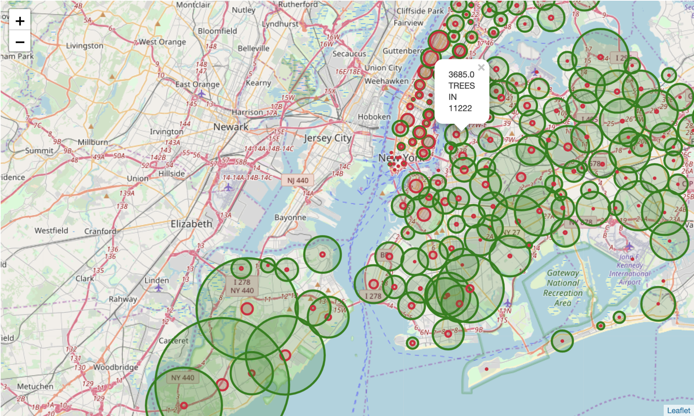

# Exploring Relationships of Dog Licenses and Tree Health in NYC
## Abstract
In this repo, we explored impact of dog licenses on Tree Health.  We were particularly interested on how number of dogs in the neighborhood of a tree affect its health quality.  Later on, we also were interested in exploring relations between density of dog population and tree population.

- Christopher Bratkovics
- Brendan Connelly
- Jasmine Vasandani
- Nour Zahlan

## Process
### Data Collection
All of our data was sourced by NYC Open Data, a government run website that is published online.  More information can be found by following these links for each set:
- [2015 Street Tree Census](https://data.cityofnewyork.us/Environment/2015-Street-Tree-Census-Tree-Data/pi5s-9p35) 
- [NYC Dog Licensing Dataset](https://data.cityofnewyork.us/Health/NYC-Dog-Licensing-Dataset/nu7n-tubp)

The datasets are too large to store in this repo, if you are interested in fetching it for yourself however, we have included notebooks that will pull through the open data API and output to a csv.  Please be aware these notebooks require the use of an NYC Open Data account and API key, which is available for free.

## EDA
Once we had collected our data, we needed to combine them into one cross referenced table.  To do this, we used our dog license data to find a population per zip code, and then we could use a Tree’s zip code in order to map a population to each observation and work from there.

Much of our data cleaning was just inferencing what missing values indicated, and the data dictionaries provided.  Most of the time it merely indicated an absence or a dead tree.  After that, we had about 1300 trees unaccounted for, which compared to about 680,000 we just ended up dropping these rows, assuming they are missing completely at random.

## Findings
Through conducting exploratory data analysis, we learned that there is no relationship between the health of a tree and the administration of dog licenses in any given area in New York City. However, we made other significant insights that contradict popular opinions. Through GIS mapping, we learned that the density of trees in an area does affect the number of dogs in an area. In the map below, red indicates dogs, trees indicates green. The size of the bubbles correspond to the number of dogs and trees, respectively. 

## Looking Ahead
Using the [Department of Health and Mental Hygiene (DOHMH)’s Dog Bite](https://data.cityofnewyork.us/Health/DOHMH-Dog-Bite-Data/rsgh-akpg) dataset, we would be interested in exploring a relationship between dog behavior and tree health. Additionally, we would look closer into the health of a tree and other features that might affect tree health, such as proximity of trash cans, the presence of tree guards, and so on. 

